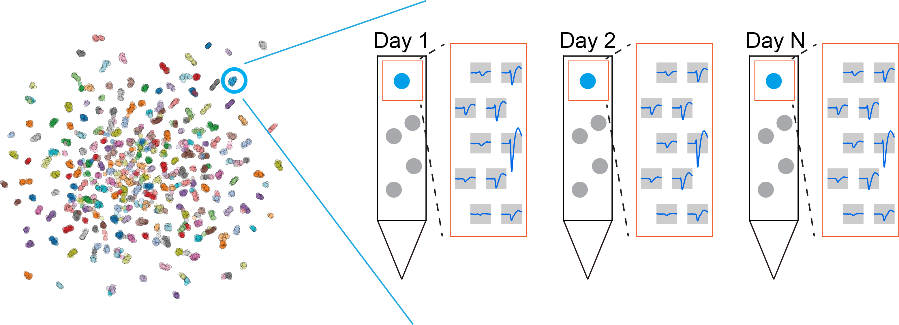

Clustering
============

How to track neurons across days
-----------------------------------

Now we have the tools to compute similarity between any two units (see :doc:`Features <Features>` and :doc:`Motion correction <Motion_correction>`). The next question is: how do we use that information to actually track neurons across sessions? 

Traditionally, researchers focused on finding matches between two sessions. That is essentially a binary classification problem: classify all unit pairs from two sessions into a "matched" class or an "unmatched" class. The selected features and classification method vary across different algorithms. However, that still does not solve the full tracking problem. In neuron tracking, we need to identify "chains" (made up of multiple units from different sessions), not just "matches" (made up of two units). Turning those pairwise matches into reliable chains remains an unsolved and challenging problem, and that is exactly the gap DANT is designed to address.

Here, we approach the tracking problem from a different angle, and that shift in perspective makes the problem much more tractable. We formulate it as a clustering task, treating units from different sessions as points in a high-dimensional space, where units from the same neuron cluster together. The unsupervised UMAP projection visualizes all units in a 2D space (left panel). Our goal is then to group units from the same neuron with a suitable clustering algorithm. Common clustering algorithms such as k-means, Gaussian mixture models, and DBSCAN are not well suited to this task because the number of clusters is unknown, some neuron clusters are small and transient, and the data distribution is not Gaussian. This is exactly where HDBSCAN becomes useful, because it can handle the messy structure that neuron-tracking data naturally produce.

.. _HDBSCAN_label:

HDBSCAN
------------

.. image:: ./images/DistanceMatrix.png
   :width: 100%
   :align: center

HDBSCAN is an unsupervised clustering algorithm that extends DBSCAN by
turning it into a hierarchical clustering method. We used the
Python implementation at https://github.com/scikit-learn-contrib/hdbscan. The parameters used in this paper were:
``min_cluster_size`` = 2, ``max_cluster_size`` = maximum session number,
and ``min_samples`` = 1. The input distance matrix :math:`\mathbf{D}` is defined
as:

.. math::

    \begin{aligned}
    \mathbf{D}_{i,j} &={\begin{cases}0&{\text{if }}i=j,\\\frac{1}{1+\tanh(\mathbf{S}_{i,j})}&{\text{else }}\end{cases}}
    \end{aligned}.

HDBSCAN begins by transforming similarity scores (1st panel) into distances (2nd panel) and constructing a robust single-linkage tree, which reorders units so that similar units lie close to one another (3rd and 4th panels). It then extracts clusters from the tree based on cluster stability (the white dashed boxes indicate clusters). Units from the same neuron form distinct blocks in the distance matrix (4th panel) and distinct clusters in the UMAP projection, which supports the clustering-based view of the problem.

.. _weight_optimization_label:

Weight optimization
-----------------------

.. image:: ./images/WeightOptimization.png
   :width: 60%
   :align: center

Another challenge is deciding how much each metric should matter. These metrics are not equally informative, and the importance of a given feature may vary across animals, brain regions, electrode types, and other factors. It is therefore important to determine the best weights for each dataset. Starting from equal weights (see :ref:`weighted similarity <weighted_similarity_label>` for details), HDBSCAN already gives us a useful first split between matches and nonmatches. When the similarity scores are plotted in a 2-dimensional subspace, matches and nonmatches form distinct clusters (blue and black points). 

To estimate the importance, or weight, of each metric, we use linear discriminant analysis (LDA), which finds a one-dimensional projection that maximizes separation between matches and nonmatches. Because unmatched pairs greatly outnumber matched pairs, only spatially close unit pairs (within 100 μm in the :math:`y` position by default) are included. This analysis is performed using MATLAB's ``fitcdiscr`` function. The LDA model assumes that similarity scores for matched and unmatched pairs follow multivariate Gaussian distributions with identical covariance matrices. It then generates a hyperplane that maximizes separation between the two classes. The coefficients of the hyperplane's normal vector serve as weights for building a single optimized similarity score, reflecting the relative importance of each feature. Projecting the data onto this one-dimensional vector maximizes the separation between matches and nonmatches. We then use the weights from that projection to compute the final similarity scores. Finally, the updated similarity matrix provided by LDA is used in the next round of clustering. In addition, the hyperplane defines a similarity threshold (the red dashed line), which becomes useful in the later :ref:`curation step <auto_curation_step2_label>`.

The initial clustering rounds identify the matches that seed motion correction. To minimize false positives, these matches must also satisfy the LDA decision boundary. The final clustering round generates the output results, followed by the auto-curation step.

.. _iterative_clustering_algorithm_label:

Iterative clustering algorithm
---------------------------------

.. image:: ./images/IterativeClustering.png
   :width: 100%
   :align: center

Because HDBSCAN benefits from refined similarity scores, and LDA in turn benefits from accurate cluster labels, DANT uses an iterative algorithm that lets the two improve each other step by step. This process helps prioritize the most informative features for each dataset when determining unit similarity across sessions.

At the start of the algorithm, weights are initialized equally across all selected features. Clustering and weight optimization are then performed alternately: HDBSCAN identifies unit clusters based on the current weights, and LDA refines those weights based on the resulting clusters. This back-and-forth refinement produces stable, biologically consistent results that are more robust than what a single-pass approach can usually deliver.

To ensure efficient convergence, the algorithm monitors changes in feature weights across successive iterations. Once the weight updates fall below the threshold specified by ``weight_tol`` (see :ref:`here <weight_tol_setting_label>` for details), the algorithm stops. This convergence-based approach allows the process to continue until the clustering results have stabilized while avoiding unnecessary computation. A maximum of 10 iterations is maintained as a secondary safeguard (see :ref:`here <n_iter_setting_label>` for details on modifying this limit).

DANT runs this iterative clustering multiple times, both before and after motion correction (see :ref:`iterative motion correction <iterative_motion_correction_label>` for details), so the clustering can benefit from each improvement in alignment. After motion correction, the weight of the waveform feature increases in nearly all datasets, highlighting the improved reliability of motion-corrected waveforms for neuron tracking. 

