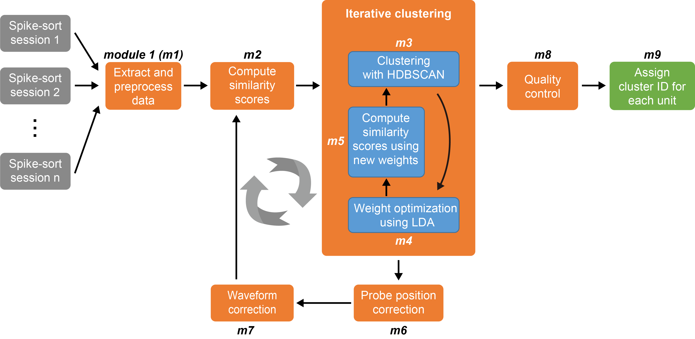

Overview
================

DANT is available in both MATLAB and Python versions for tracking neurons across days with high-density probes (Neuropixels).

- **MATLAB version**: `DANT <https://github.com/jiumao2/DANT>`_
- **Python version**: `pyDANT <https://github.com/jiumao2/pyDANT>`_

Pipeline
----------------

DANT takes well spike-sorted data as input and assigns a unique cluster ID to each unit as output. DANT does not require a user-defined "threshold" to filter good matches, providing a fully automatic way to track the same neurons across days to months.

Following spike sorting of each session :math:`(1, 2, \ldots, n)` independently, well-isolated units from each session are provided as input to DANT. :doc:`Features <Features>` for similarity analysis are extracted from each unit (Module 1, m1), including :ref:`spike waveforms <waveform_similarity_label>` across all channels and, optionally, :ref:`autocorrelograms (ACGs) <Autocorrelogram_feature_label>` as well as :ref:`peri-event time histograms (PETHs) or peri-stimulus time histograms (PSTHs) <PETH_feature_label>` that capture functional properties. :ref:`Similarity scores <weighted_similarity_label>` between unit pairs are then computed using feature-specific weights (equal initial weights across the selected features, m2), which are transformed into pairwise distances representing dissimilarity. A :ref:`density-based clustering <iterative_clustering_algorithm_label>` algorithm applied to these distances identifies matched units hypothesized to originate from the same neuron (m3). Using these provisional clusters, :ref:`linear discriminant analysis (LDA) <weighted_similarity_label>` optimizes the feature weights to maximize discrimination between matched and unmatched pairs (m4), yielding updated similarity scores and distances (m5). Clustering is iterated until the weights stabilize and the results converge. Using matched pairs' spatial information, relative :ref:`probe movement <motion_estimation_label>` is inferred jointly across sessions (m6), and spike waveforms are :ref:`remapped <waveform_correction_label>` to probe recording sites, correcting for movement-induced changes in waveform distributions across channels (m7). The m2--m7 loop is repeated according to the configured motion-correction schedule and early-stopping rule. The final clustering output (m3) then undergoes a :doc:`quality control step <Auto_curation>` (m8) to remove within-cluster pairs that fail the LDA-derived similarity criterion. Clusters are then assigned IDs (m9) representing units recorded across multiple sessions, from 2 up to :math:`n`, that are hypothesized to originate from the same neuron.

The iterative core of the pipeline is formed by :ref:`the clustering loop <iterative_clustering_algorithm_label>` and :ref:`the motion correction loop <iterative_motion_correction_label>`, corresponding to repeated execution of m2--m7. These loops alternately refine the estimated probe motion, feature weights, corrected waveforms, and clustering results. Click on the linked sections for details.

