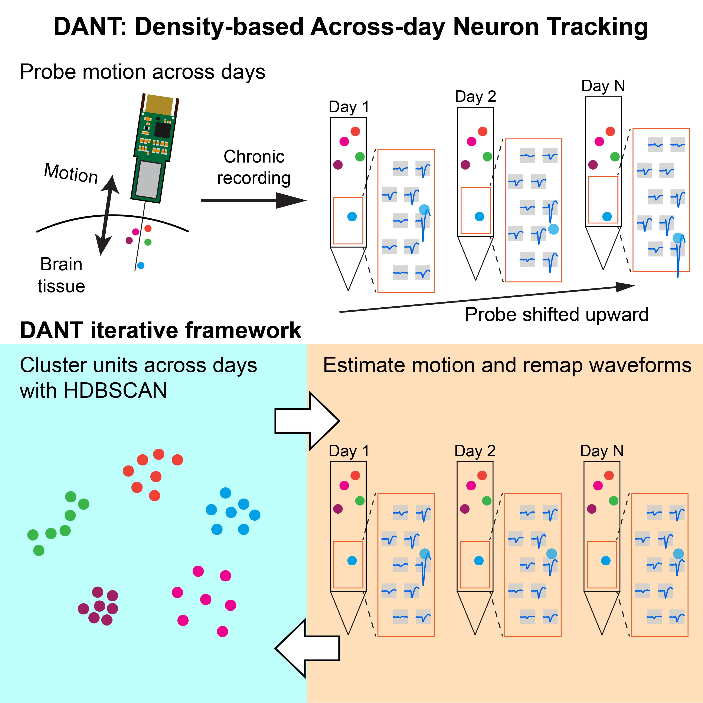

Welcome to DANT's documentation!
============================================

|

**DANT** is a MATLAB toolbox that combines iterative motion correction and density-based clustering to robustly track single neurons across days of high-density recordings.

.. toctree::
   :maxdepth: 1
   :caption: Contents

   Overview <Overview>
   Installation <Installation>
   Tutorials <Tutorials>
   Change default settings <Change_default_settings>

   Center waveforms <Center_waveforms>

   Features <Features>

   Motion correction <Motion_correction>
   Clustering <Clustering>

   Auto curation <Auto_curation>
   
   Input and output (IO) <IO>
   API <API>

   Contact us <Contact_us>

